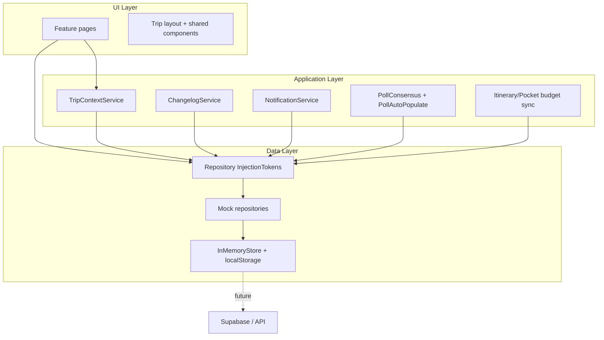

# Travel Planner — Codebase Guide

This document is the primary reference for understanding how this repository is organized, what features are implemented, and how data flows through the app. Read this before diving into individual files.

---

## Overview

**Travel Planner** is a group travel planning MVP built with **Angular 21**. It helps friends and families coordinate trips: create trips, invite members, plan itineraries, track budgets, run polls, store tickets in a pocket, keep a diary, and more.

The app is **mock-first**: all persistence goes through an in-memory store with optional `localStorage` backup. There is no production backend yet. Repository interfaces define the swap boundary for a future Supabase (or other) API.

**UI approach:** Mobile-first, standalone components, folder-per-component (`.ts` / `.html` / `.scss` per folder).

---

## Tech stack

| Layer | Technology |
|-------|------------|
| Framework | Angular 21 (standalone components, signals, lazy routes) |
| SSR | `@angular/ssr` + Express (`outputMode: server`) |
| Styling | Tailwind CSS v4 theme tokens + global SCSS (`src/styles.scss`) |
| State / async | RxJS `BehaviorSubject` streams, Angular signals |
| Tests | Vitest via `ng test` |
| Deploy | Azure Web App (Node SSR), not Static Web Apps |

---

## Repository layout

```
travel-planner-angular/
├── docs/
│   └── CODEBASE.md          ← you are here
├── src/
│   ├── app/
│   │   ├── core/            # Domain models, guards, utils, cross-cutting services
│   │   ├── data/            # Repository interfaces + mock implementations
│   │   ├── features/        # Feature modules (pages + feature components)
│   │   ├── layout/          # App shells, trip nav, bottom nav
│   │   ├── shared/          # Reusable UI components
│   │   ├── app.routes.ts    # Route definitions
│   │   └── app.config.ts    # DI providers (mock repos)
│   ├── styles.scss          # Global UI patterns (.btn, .card, .field)
│   └── tailwind.css         # Tailwind v4 theme tokens only (no preflight)
├── run.cjs                  # Azure iisnode bootstrap
├── web.config               # IIS rewrite to Node
├── .deployment              # Skip Oryx rebuild on Azure
└── README.md                # Build, deploy, quick start
```

### `src/app/core/`

| Path | Purpose |
|------|---------|
| `models/index.ts` | All domain types (`Trip`, `Poll`, `BudgetEntry`, etc.) |
| `tokens/repository.tokens.ts` | Angular `InjectionToken`s for repositories |
| `services/` | Cross-feature services (changelog, notifications, poll logic) |
| `guards/` | `authGuard`, `tripMemberGuard` |
| `utils/` | Pure helpers (dates, countdown, settlement, validators) |
| `constants/` | Shared constants (e.g. poll tag lists) |

### `src/app/data/`

| Path | Purpose |
|------|---------|
| `repositories/*.repository.ts` | **Interfaces** — the backend swap boundary |
| `mock/in-memory-store.ts` | Single `AppData` blob + `localStorage` key `travel-planner-mock-v2` |
| `mock/repositories/*.ts` | Mock implementations of each repository |
| `mock/mock-auth.service.ts` | Demo login (session in memory) |
| `mock/mock.providers.ts` | Registers all mock repos in `app.config.ts` |

### `src/app/features/`

Each feature is a folder with `pages/`, `components/`, and optionally `services/`:

| Feature folder | Route(s) | Summary |
|----------------|----------|---------|
| `auth/` | `/auth/login`, `/auth/signup` | Demo authentication |
| `trips/` | `/trips`, `/trips/new` | List and create trips |
| `trip-dashboard/` | `/trips/:id/dashboard` | Trip header, countdown, quick tiles |
| `members/` | `/trips/:id/members`, `/invite/:token` | Invite link, member list, late-joiner onboarding |
| `itinerary/` | `/trips/:id/itinerary` | Day strip, time grid, drag-and-drop activities |
| `budget/` | `/trips/:id/budget` | Expenses, splits, settlement, receipts |
| `polls/` | `/trips/:id/polls` | Enhanced polls with consensus and auto-populate |
| `pocket/` | `/trips/:id/pocket` | Tickets, confirmations, attachments |
| `diary/` | `/trips/:id/diary` | Photo/note feed |
| `food-spots/` | `/trips/:id/food` | Restaurant list with meal filter |
| `changelog/` | `/trips/:id/changelog` | Read-only trip event history |
| `packing-list/` | `/trips/:id/packing` | Shared packing list with claim/unclaim |
| `post-trip/` | `/trips/:id/summary`, `/ratings` | Post-trip stats and ratings |

### `src/app/layout/`

| Component | Role |
|-----------|------|
| `main-layout/` | Authenticated shell (top-level nav) |
| `auth-layout/` | Login/signup shell |
| `trip-layout/` | Trip shell: desktop nav, bottom nav, Quick Add FAB, onboarding modal |
| `trip-bottom-nav/` | Mobile primary tabs + “More” sheet |

### `src/app/shared/components/`

Reusable UI used across features:

| Component | Used for |
|-----------|----------|
| `page-header/` | Page title + action slot |
| `empty-state/` | Empty lists |
| `trip-countdown/` | Upcoming / ongoing / past / **no dates** |
| `member-avatar-stack/` | Member avatars on dashboard |
| `confirm-dialog/` | Destructive confirmations |
| `audit-trail-feed/` | Activity/budget change history |
| `notification-toast/` | In-app toast host |
| `quick-add-fab/` + `quick-add-sheet/` | Fast add expense or activity |

---

## Architecture



### Request flow (typical feature page)

1. Page injects a repository token (e.g. `BUDGET_REPOSITORY`) and `TripContextService`.
2. `TripContextService` loads the current trip from the route param `tripId`.
3. Page subscribes to `repo.list(tripId)` via `toSignal` + `store.data$` (reactive updates).
4. User action calls `repo.create()` / `update()` → mock mutates `InMemoryStore` → UI updates.
5. Side effects: `ChangelogService.log()`, `NotificationService.notifyUser()`, budget sync services.

---

## Mock data layer

### What is real vs mock

| Real | Mock (MVP) |
|------|------------|
| Angular UI, routing, validation, business logic | Database / API |
| SSR build and Azure hosting | Cross-browser / cross-device sync |
| Repository interface contracts | Push notifications, SMS/email |
| `localStorage` in same browser | Cloud file storage (receipts use data URLs) |

### InMemoryStore

- **File:** `src/app/data/mock/in-memory-store.ts`
- **Storage key:** `travel-planner-mock-v2` (migrates from `v1` if present)
- **Collections:** users, trips, members, activities, budgetEntries, polls, pollVotes, pollNudges, pocketItems, diaryEntries, foodSpots, changelog, notifications, packingItems, tripRatings, activityRatings

### Swapping to a real backend

1. Implement each interface in `src/app/data/repositories/`.
2. Create e.g. `src/app/data/supabase/` implementations.
3. Replace providers in `mock.providers.ts` (or add environment-based provider factory in `app.config.ts`).

Do **not** import `InMemoryStore` from feature code — always go through repository tokens.

---

## Routing

Defined in `src/app/app.routes.ts`.

| Path | Guard | Description |
|------|-------|-------------|
| `/auth/login`, `/auth/signup` | — | Auth pages |
| `/trips` | `authGuard` | Trip list |
| `/trips/new` | `authGuard` | Create trip |
| `/trips/:tripId/*` | `authGuard` + `tripMemberGuard` | All trip features |
| `/invite/:token` | — | Join trip via invite (redirects to login if needed) |

**Trip child routes** (all under `/trips/:tripId/`):

`dashboard` · `members` · `itinerary` · `budget` · `polls` · `pocket` · `diary` · `food` · `changelog` · `packing` · `summary` · `ratings`

Default redirect: `/trips/:tripId` → `dashboard`.

---

## Features implemented

Features map to **Sub-PRD MVP Completion** (mock-first). Below is what each area does and where to look in code.

### Auth

- **Demo login:** `alex@example.com`, `jamie@example.com`, `sam@example.com` (any password)
- **Files:** `features/auth/`, `data/mock/mock-auth.service.ts`
- Session stored in mock auth service; no JWT/OAuth

### Trips (A1)

- **Create:** Name required; destination and dates optional (TBD / “Set travel dates” when missing)
- **Edit:** Any member can edit via dashboard `trip-edit-form`
- **Companion validation:** Adults + seniors + children must match traveler count
- **Files:** `features/trips/`, `core/utils/companion.validator.ts`, `core/utils/date-range.validator.ts`

### Trip dashboard

- Cover photo, destination (or TBD), date range, countdown widget
- Member avatar stack, quick-access tiles (desktop)
- **Files:** `features/trip-dashboard/`, `shared/components/trip-countdown/`

### Members & invites (B5)

- Invite link generation/regeneration, join by token
- Remove member (organizer rules in UI)
- **Late joiner onboarding:** Modal on first visit if joined after trip creation
- **Files:** `features/members/`, `late-joiner-onboarding/`

### Itinerary (A3)

- Day strip + time grid with overlap column layout
- CRUD activities; estimated cost syncs to budget
- **Drag-and-drop** on time grid to move activities
- **Padlock dialog** when moving paid-linked activities
- **Overlap notifications** (in-app mock) to all members
- **Audit trail** on activity create/update/move/delete
- Requires trip dates for calendar; message shown if dates not set
- **Files:** `features/itinerary/`, `core/utils/time.utils.ts`, `itinerary-budget-sync.service.ts`

### Budget (A4)

- Categories: flights, accommodation, food, activities, transport, others
- Trip budget limit + progress overview
- **Who it covers** — split per member
- **Settlement tab** — net positions + simplified who-pays-whom
- **Paid status** + receipt upload (mock data URL)
- **Audit trail** on entries
- Auto-entries from itinerary and pocket (and polls)
- **Files:** `features/budget/`, `core/utils/settlement-calculator.ts`

### Polls (A2 + B1)

- Categories: hotel, restaurant, activity, transport, general, other
- Rich options: price, link, tags (hotel/restaurant tag lists, max 5)
- **Status flow:** `open` → `finalizing` → `locked` → `closed`
- Majority detection → finalization → confirm / flag concern
- Organizer **executive lock**
- On lock: **auto-populate** trip/pocket/budget/itinerary/food via `PollAutoPopulateService`
- **Nudge** non-voters (1/day/sender/target, mock in-app notification)
- **Files:** `features/polls/`, `core/services/poll-consensus.service.ts`, `core/services/poll-auto-populate.service.ts`

### Pocket

- Types: flight, accommodation, entrance, transport, others
- Attachment mock (data URL), amount syncs to budget
- **Files:** `features/pocket/`, `pocket-budget-sync.service.ts`

### Diary

- Photo and note entries with date tags
- Lightbox for photos
- **Files:** `features/diary/`

### Food spots

- List with meal type filter (breakfast, lunch, dinner, etc.)
- “Tried” toggle per member
- **Files:** `features/food-spots/`

### Changelog (B4)

- Append-only event feed for trip mutations
- Logged from trips, members, polls, activities, budget, packing
- **Files:** `features/changelog/`, `core/services/changelog.service.ts`

### Packing list (B3)

- Add items, claim/unclaim (with transfer prompt if already claimed)
- Filters: All / Claimed / Unclaimed
- **Files:** `features/packing-list/`

### Quick Add (B2)

- FAB on all trip routes (above bottom nav)
- Bottom sheet: add expense or add activity
- **Files:** `shared/components/quick-add-fab/`, `quick-add-sheet/`

### Post-trip (B6 + B7)

- **Summary:** Unlocks after trip end date; stats + share/copy
- **Ratings:** Trip and per-activity ratings (1–5), group average
- **Files:** `features/post-trip/`, `core/models` helpers `isTripPast()`

### Notifications (B1 — mock)

- In-app toast + notification records in store
- No real push; same-browser session only
- **Files:** `core/services/notification.service.ts`, `shared/components/notification-toast/`

---

## Core services reference

| Service | File | Role |
|---------|------|------|
| `TripContextService` | `core/services/trip-context.service.ts` | Current trip from route; provided on `TripLayout` |
| `ChangelogService` | `core/services/changelog.service.ts` | Append changelog entries |
| `AuditTrailService` | `core/services/audit-trail.service.ts` | Field diffs → readable audit lines |
| `NotificationService` | `core/services/notification.service.ts` | Mock notify + toast |
| `PollConsensusService` | `core/services/poll-consensus.service.ts` | Majority / finalization logic |
| `PollAutoPopulateService` | `core/services/poll-auto-populate.service.ts` | On poll lock → write related entities |
| `ItineraryBudgetSyncService` | `features/itinerary/services/` | Activity cost → budget entry |
| Pocket budget sync | `features/pocket/services/` | Pocket amount → budget entry |

---

## Repository tokens

All injected via `src/app/core/tokens/repository.tokens.ts`:

| Token | Interface | Mock impl |
|-------|-----------|-----------|
| `TRIP_REPOSITORY` | `TripRepository` | `mock-trip.repository.ts` |
| `MEMBER_REPOSITORY` | `MemberRepository` | `mock-member.repository.ts` |
| `ACTIVITY_REPOSITORY` | `ActivityRepository` | `mock-activity.repository.ts` |
| `BUDGET_REPOSITORY` | `BudgetRepository` | `mock-budget.repository.ts` |
| `POLL_REPOSITORY` | `PollRepository` | `mock-poll.repository.ts` |
| `POCKET_REPOSITORY` | `PocketRepository` | `mock-pocket.repository.ts` |
| `DIARY_REPOSITORY` | `DiaryRepository` | `mock-diary.repository.ts` |
| `FOOD_SPOT_REPOSITORY` | `FoodSpotRepository` | `mock-food-spot.repository.ts` |
| `CHANGELOG_REPOSITORY` | `ChangelogRepository` | `mock-changelog.repository.ts` |
| `NOTIFICATION_REPOSITORY` | `NotificationRepository` | `mock-notification.repository.ts` |
| `PACKING_REPOSITORY` | `PackingRepository` | `mock-packing.repository.ts` |
| `RATING_REPOSITORY` | `RatingRepository` | `mock-rating.repository.ts` |

---

## Domain models (high level)

Full definitions: `src/app/core/models/index.ts`.

| Entity | Notable fields |
|--------|----------------|
| `Trip` | Optional `destination`, `startDate`, `endDate`; `organizerId`, `companions` |
| `TripMember` | `onboardingSeen` for late joiner flow |
| `Activity` | `pocketItemId`, `isPadlocked`, `auditLog[]` |
| `BudgetEntry` | `coveredBy[]`, `payerId`, `paid`, `receiptUrl`, `auditLog[]`, source `poll` |
| `Poll` | `category`, rich options, status machine, `confirmations`, `concerns` |
| `ChangelogEntry` | `type`, `summary`, `actorId`, `metadata` |
| `PackingItem` | `claimedBy`, `claimedByName` |
| `TripRating` / `ActivityRating` | Post-trip ratings |

Helper functions: `hasTripDates()`, `formatTripDestination()`, `formatTripDateRange()`, `isTripPast()`.

---

## UI & styling conventions

### Folder-per-component

Each component lives in its own folder:

```
feature-name/
  components/
    my-widget/
      my-widget.ts
      my-widget.html
      my-widget.scss
  pages/
    my-page/
      my-page.ts
      my-page.html
      my-page.scss
```

Angular schematics should generate this structure (configured in `angular.json`).

### Global styles

- **`src/tailwind.css`** — Tailwind v4 `@theme` tokens only (no preflight, avoids form/button reset issues)
- **`src/styles.scss`** — CSS variables, `.btn`, `.card`, `.field`, layout tokens (`--bottom-nav-height`)
- **Feature SCSS** — Component-scoped; shared partials in `shared/styles/` (e.g. `_modal-actions.scss`)

### Mobile navigation

- **Bottom nav:** Home, Plan, Budget, Polls + More sheet (Pocket, Packing, Diary, Eat, Changelog, Summary, Members)
- **Desktop:** Horizontal nav in `trip-layout`
- **Quick Add FAB:** Fixed above bottom nav on mobile

---

## Testing

```bash
npm test          # Vitest via Angular CLI
npm run build     # Production build + SSR prerender
```

**Unit tests** (pure logic):

| File | Covers |
|------|--------|
| `core/utils/companion.validator.spec.ts` | Companion breakdown rules |
| `core/utils/date-range.validator.spec.ts` | Optional date validation |
| `core/utils/countdown.utils.spec.ts` | Countdown incl. `no_dates` |
| `core/utils/settlement-calculator.spec.ts` | Budget splits & settlement |
| `core/services/poll-consensus.service.spec.ts` | Poll majority logic |

---

## Deployment (Azure Web App)

Same pattern as sibling project **sweldopinoy**: Node 22 + iisnode → `run.cjs` → SSR bundle.

| Artifact | Purpose |
|----------|---------|
| `run.cjs` | ESM SSR bootstrap for iisnode |
| `web.config` | IIS rewrite to Node |
| `.deployment` | Skip server-side Oryx rebuild |

Use Azure **Deployment Center** to connect GitHub; do not use Azure Static Web Apps for this repo.

See [README.md](../README.md) for build commands.

---

## Development quick start

```bash
npm install
npm run start:dev    # http://localhost:4200
```

1. Log in with `alex@example.com` (any password).
2. Create a trip or open an existing one from **My Trips**.
3. Use bottom nav or dashboard tiles to explore features.

To reset mock data: clear `localStorage` key `travel-planner-mock-v2` in browser devtools.

---

## Conventions for contributors

1. **Inject repositories, not the store** — keep features backend-agnostic.
2. **Log meaningful changelog events** on user-visible mutations.
3. **Keep business logic in services or pure utils** — not in templates.
4. **Match existing patterns** — signals for local UI state, `toSignal` + repo observables for server-ish data.
5. **Mobile-first** — test with bottom nav and sheets, not only desktop nav.
6. **Minimal scope** — extend existing features and repos rather than parallel implementations.

---

## Related documents

| Document | Purpose |
|----------|---------|
| [README.md](../README.md) | Install, build, deploy, demo login |
| Sub-PRD MVP Completion v1.2 | Product requirements (external) |

---

*Last updated to reflect Sub-PRD mock-first MVP implementation (V2 store, changelog, enhanced polls/budget/itinerary, packing, post-trip).*
